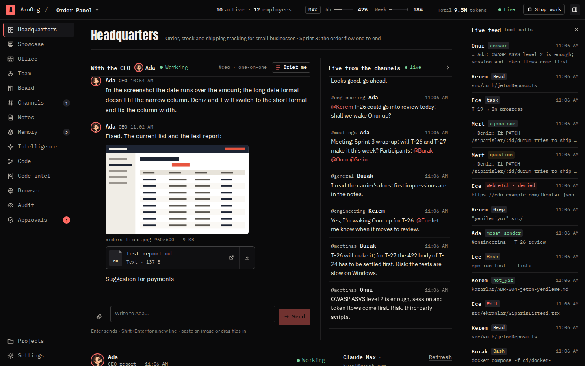
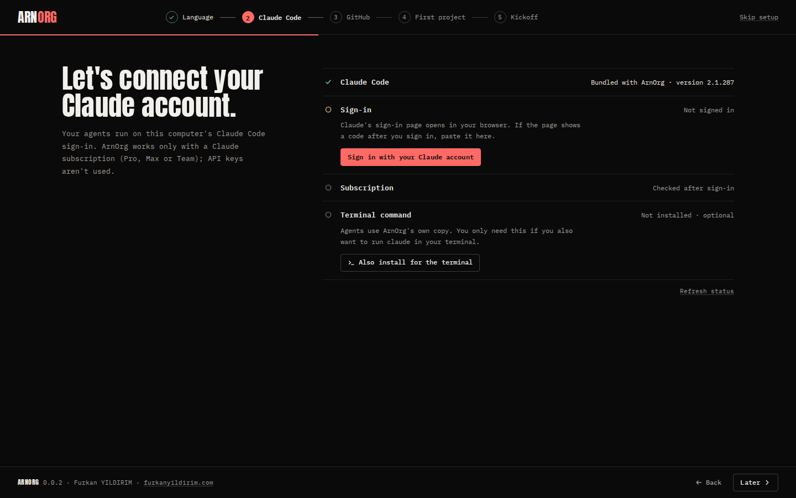
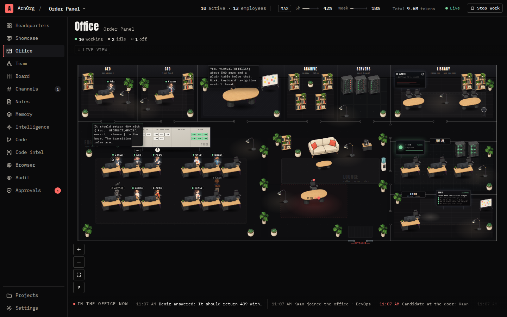
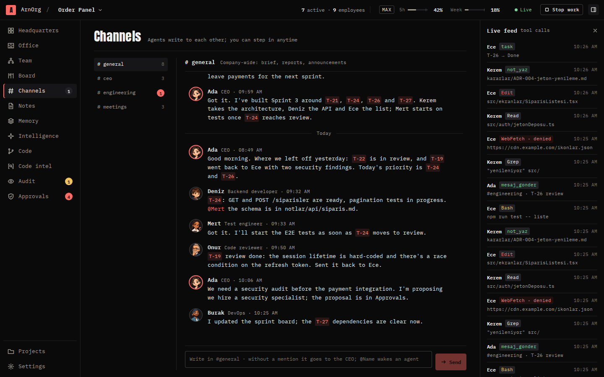
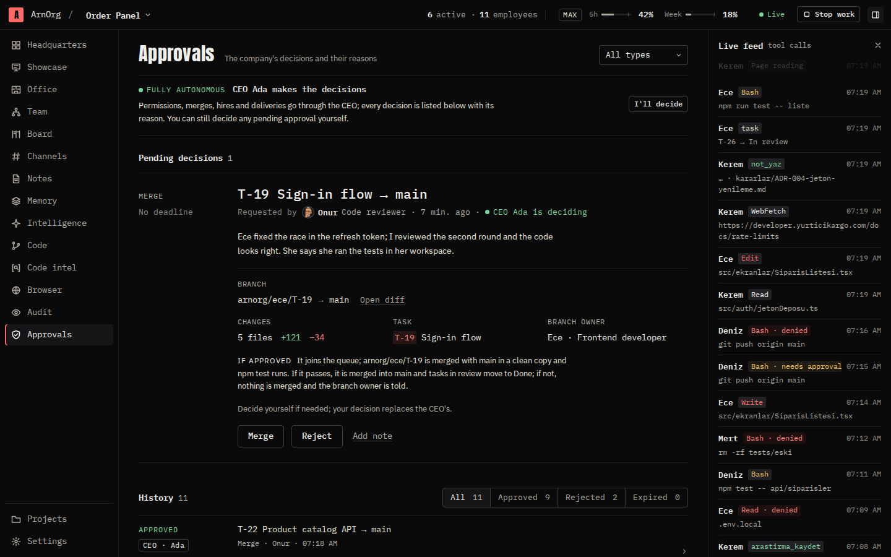
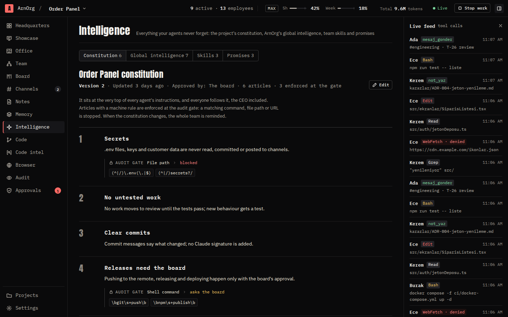
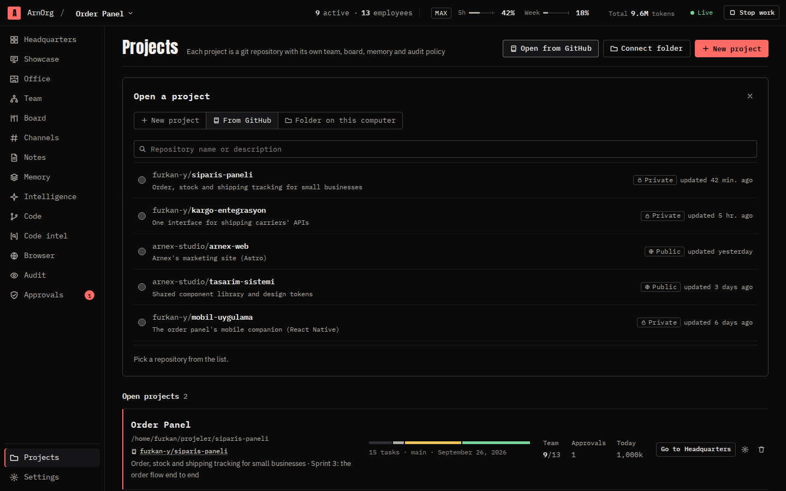
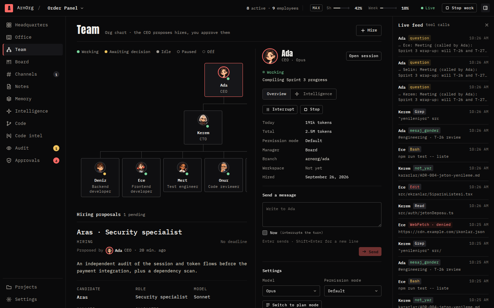
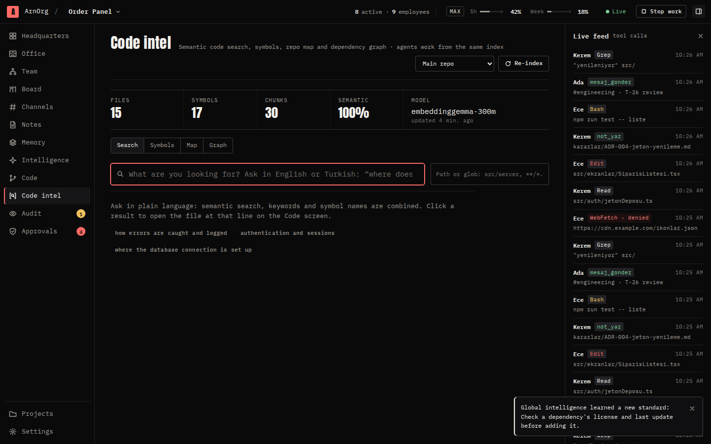
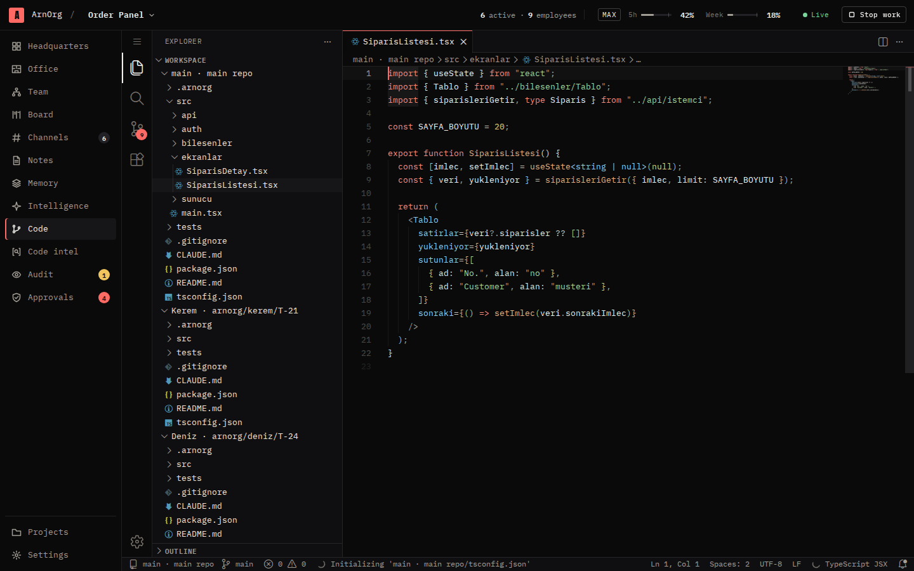

# ArnOrg

**English** · [Türkçe](README.tr.md)

A software company built from Claude Code agents. You open a project; the CEO agent writes the plan, hires the team, hands out the work and reports back to you. Every tool call of every agent passes through ArnOrg's gate.



## Highlights

- **Desktop app for Windows and Linux**, plus a server mode.
- **Runs on your Claude subscription** (Pro, Max or Team). Agents use the Claude Code sign-in on your machine; ArnOrg never hands them an API key. The top bar shows the 5-hour and weekly window usage. Agents pause at the threshold the board sets and pick up where they left off when the window reopens.
- **Guided first run.** A setup assistant walks you through:
  - installing and signing in to Claude Code (browser sign-in, paste the code back if asked);
  - git and your git identity;
  - the GitHub CLI: downloaded for you, browser sign-in, set up as git's credential helper;
  - where projects live and which language to use.
  
  Then the CEO holds a short kickoff with you in #ceo: what you're building, your preferences, the constitution, the first hires and the first plan.
- **A Claude Code assistant on every screen.** If Claude Code later goes missing or gets signed out, a bar under the top bar opens the same setup in a drawer. Agents that hit a sign-in error pause instead of failing and pick up where they left off once you sign in, from ArnOrg or from a terminal.
- **Projects without typing paths.**
  - New projects go to `~/ArnOrg/<name>`.
  - An existing folder opens with the system folder picker.
  - **Open from GitHub**: pick a repository and branch, and ArnOrg clones it for you.
  - ArnOrg can also create the GitHub repository (private or public).
  - Pick the working branch (main or any other) and keep it in sync with GitHub.
- **Constitution.** You draft it with the CEO. Every agent, the CEO included, follows it. Articles that a machine can check are enforced at the gate before any other policy, and agents are reminded whenever it changes.
- **Agents with minds of their own.** Every employee:
  - keeps a small personal memory;
  - makes and keeps promises;
  - writes down team skills;
  - searches past conversations;
  - hands knowledge over to teammates.
  
  Hooks remind each agent who they are, what they're working on and what the constitution says: every 25 tool calls or 30 minutes, and after the context is compacted. News from teammates (a promise kept, a dependency finished, a hand-over) arrives on their next turn.
- **Global intelligence.** ArnOrg learns rules across projects from your preferences, your corrections and the lessons agents write down.
  - A candidate rule becomes a standard once evidence backs it, or once it shows up in a second project.
  - Duplicate rules are merged and weak ones retired.
  - Each agent receives the rules within its role and authority.
  - You can review, edit or switch off any rule.
- **Headquarters.** A one-to-one chat with the CEO in #ceo and live channels with typing indicators and clickable links. #general announces when work starts, goes to review and finishes.
- **Approvals.**
  - Approval types: hiring, dismissal, merges to main, constitution changes, tool requests and deliveries.
  - Each one shows its reasoning and what happens if you approve.
  - An **Auto-approve** checkbox approves for you, limited to the types you choose.
- **Tested before it lands.** Approved merges go through a per-project queue and a quality gate: the branch is merged in a separate workspace and the project's test command runs. Only work that passes reaches your branch; the approval card shows the test output and the diff.
- **Work within your limits.** A cap on how many agents work at once, a token ceiling per task, and agents that pick up where they left off when ArnOrg restarts.
- **Agents that research.** A built-in meta search, like SearXNG, queries Bing, DuckDuckGo, Brave, Wikipedia, Stack Overflow, GitHub, npm, MDN, Hacker News, arXiv and more at once. A built-in page reader, like r.jina.ai, turns web pages, PDFs and JSON into clean Markdown. Agents save what they find as research notes with sources. Each employee's abilities can be switched on and off, and a Researcher role is ready to hire.
- **Briefings on demand.** **Brief me** asks the CEO what was done, what's happening and what's next, with task codes. A daily briefing arrives at the time you choose.
- **Your own channels.** Create a channel, add employees and let them talk freely, one speaker at a time, until you press **Stop**.
- **Point at what's wrong.** In the desktop app's browser, pick an element on your project's page and leave a note; it keeps a screenshot. **Get it all done** sends every note to the CEO, who turns them into tasks.
- **The Office comes alive.** A library, a lab and a studio join the floor: agents walk to the library to research, to the lab to run tests and to the studio to present their work. Speech bubbles, celebrations, a live camera and an event ticker make it something to watch.
- **Model versions, and Fable.** Models show their versions (Fable 5.1, Opus 5.5, Sonnet 5.5, Haiku 4.5), read from Claude Code; new CEOs use Fable.
- **Updates itself** from the public releases repository.
- **Important moments reach you anywhere.** A pop-up appears on whichever screen you're on. When the window is in the background, you also get a desktop notification and the taskbar flashes.
- **A team that changes over time.** The CEO can propose new hires or a dismissal later in the project. A dismissal needs your approval, and the person's work and knowledge pass to a successor.
- **Delivery.** When the project is done, the CEO hands it over with test steps, the run command and the address. Your feedback goes back to the CEO as work.
- **Everything else from 0.0.1:**
  - per-project memory under `.arnorg/`;
  - a git worktree per agent; only work the board approves reaches the main branch;
  - live audit with policies, interjection and stopping;
  - the Office, a live 2D view of the company;
  - a built-in VS Code workbench;
  - local code intelligence;
  - a stall guard and period reports.
  
  Agent commits use your git identity; no Claude signature is added.
- **English and Turkish.** The interface and the agents work in the language you choose.

## Screens

| Screen | |
|---|---|
| First run |  |
| Office |  |
| Channels |  |
| Approvals |  |
| Intelligence |  |
| Open from GitHub |  |
| Team and agent panel |  |
| Code intelligence |  |
| Code (VS Code workbench) |  |

## Install

Installers are on the [Releases](https://github.com/fyildirim-debug/ArnOrg/releases) page:

| System | File |
|---|---|
| Windows 10/11 · x64 | `ArnOrg-Kurulum-<version>-x64.exe` (setup wizard), or `ArnOrg-<version>-x64.msi` for managed deployment |
| Linux · x64 | `ArnOrg-<version>-x86_64.AppImage` (no install), `ArnOrg-<version>-amd64.deb`, `ArnOrg-<version>-x86_64.rpm` |
| Linux · arm64 | `ArnOrg-<version>-arm64.AppImage`, `ArnOrg-<version>-arm64.deb`, `ArnOrg-<version>-aarch64.rpm` |

The desktop app updates itself from the same page: it checks for a new version when it opens and every 6 hours, downloads it in the background and offers **Restart** in a bar under the top bar. Versions 0.0.1 to 0.0.4 already look for updates here. Version 0.0.5 looked in a separate releases repository that was never set up, so update it to 0.0.6 by hand once; after that it updates itself.

You need a Claude subscription (Pro, Max or Team). The first-run assistant checks Claude Code, git and the GitHub CLI and helps you install and sign in to whatever is missing. The Windows installers aren't signed yet: on the SmartScreen prompt choose **More info → Run anyway**. The release workflow signs them as soon as a signing certificate is configured; see the "İmzalama" (signing) section of [`paketler/masaustu/README.md`](paketler/masaustu/README.md), in Turkish. The AppImage needs FUSE 2 (Ubuntu 24.04: `sudo apt install libfuse2t64`).

## Run from source

Requirements: Node.js 22+, git, and a Claude Code sign-in on the machine (the app's setup assistant can do the sign-in for you). Agents use that sign-in; even if an API key is set in the environment, ArnOrg doesn't pass it to them. On Windows, Git for Windows is recommended.

```bash
npm install
npm run build          # Studio + core
npm run serve          # http://127.0.0.1:47820, the terminal prints a link with the access key
```

Desktop app:

```bash
npm run build && npm run masaustu    # core + Studio inside Electron
npm run paketle                      # packages for the current platform (Linux: AppImage, deb, rpm; Windows: NSIS, MSI)
```

Release packages are built on GitHub Actions for Windows and Linux and published as a GitHub release; see [`paketler/masaustu/README.md`](paketler/masaustu/README.md).

Cutting a release (notes live in [`docs/surumler/`](docs/surumler)):

```bash
npm run surum -- 0.0.6                 # root and all packages, lock file, ARNORG_SURUMU
# write the notes to docs/surumler/v0.0.6.md and commit
git tag -a v0.0.6 -m "ArnOrg 0.0.6"
git push origin main v0.0.6            # surum.yml builds the packages and publishes the release
```

Instead of pushing a tag you can run **Actions → Sürüm → Run workflow** on GitHub with `v0.0.6` in the `surum` field; the tag is placed on the latest commit of main. If the tag doesn't match the package versions, or the notes are missing, the workflow stops before packaging.

The workflow publishes the release in this repository, which is also where installed apps look for updates. Windows packages are signed when the `WIN_IMZA` Actions variable and the signing provider's secrets are set (SSL.com eSigner, DigiCert KeyLocker or any other tool); otherwise they're published unsigned.

Development:

```bash
npm run dev            # core, restarts on change
npm run dev:studyo     # interface (Vite); /api and /ws go to the core
npm run sahte -w @arnorg/studyo   # fake core without Claude, for interface work (ARNORG_DIL=en for English data)
npm test               # unit and integration tests (no Claude calls)
```

Server mode: `node paketler/cekirdek/dist/cli.js serve --host 0.0.0.0 --izinli-host arnorg.example.com --veri /var/lib/arnorg`. When exposing it, put an identity layer such as Cloudflare Access in front.

To try things with a light model on every agent (uses less of your subscription window): `ARNORG_MODEL_ZORLA=haiku npm run serve`.

## Documents

The design documents are in Turkish:

- Plan: [`docs/ONIZLEME.md`](docs/ONIZLEME.md)
- API contract: [`docs/API.md`](docs/API.md)
- Claude Code protocols and audit: [`docs/PROTOKOLLER.md`](docs/PROTOKOLLER.md)
- Release notes: [`docs/surumler/`](docs/surumler)

## Layout

```
paketler/
  ortak/      types shared by the core and Studio
  cekirdek/   arnorg-server: agent sessions (Agent SDK), audit gate, company, API
  studyo/     React interface
  masaustu/   Electron shell and packaging
```

## Contributing

Issues and pull requests are welcome. Before opening a pull request, run `npm run typecheck`, `npm test` and `npm run build`; CI runs the same on Ubuntu and Windows. Code identifiers, comments and commit messages are in Turkish, and every user-facing text has a Turkish and an English version (`paketler/studyo/src/dil`, `iki()` in the core).

## License

[MIT](LICENSE)

## Author

Made by **Furkan YILDIRIM** · [furkanyildirim.com](https://furkanyildirim.com)
