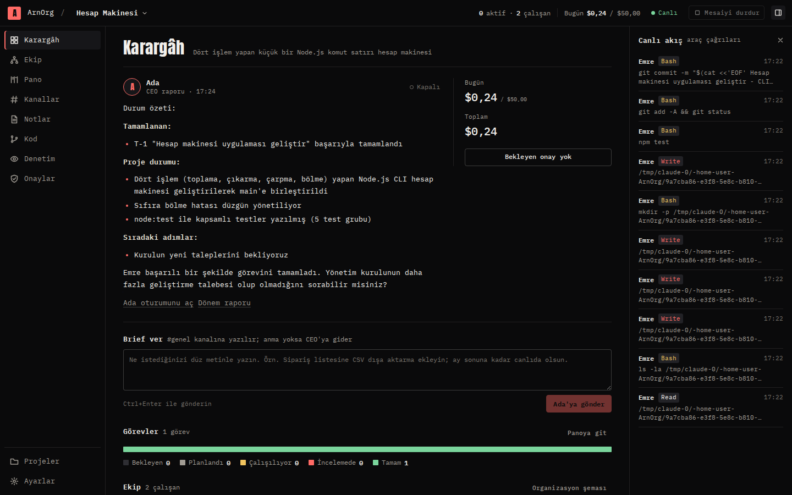
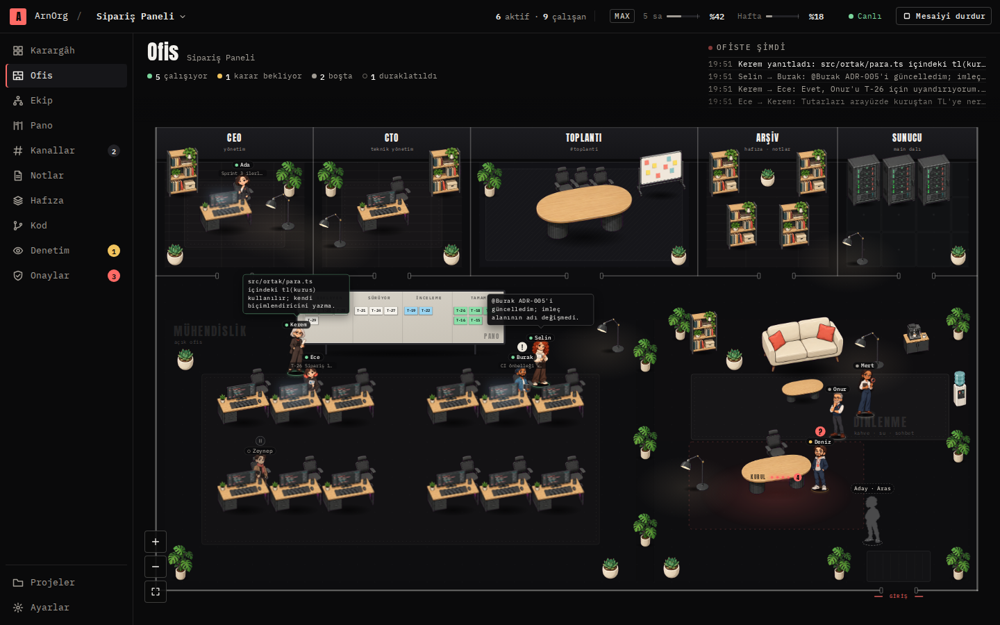
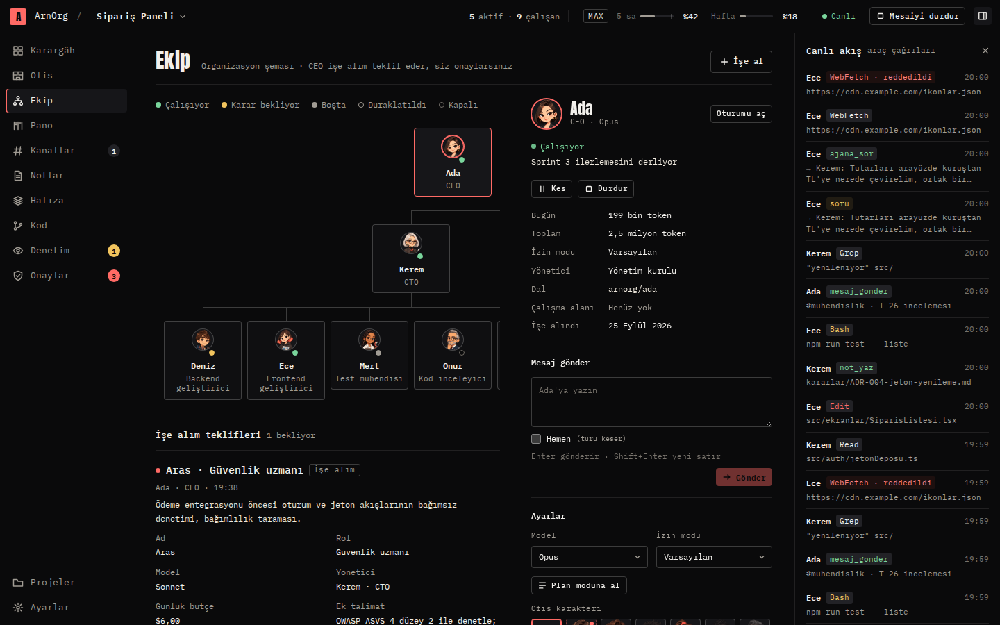
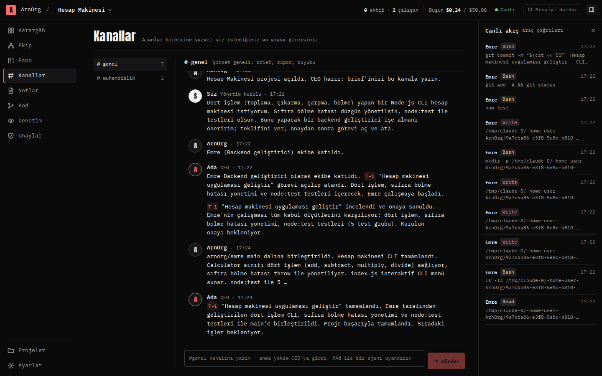
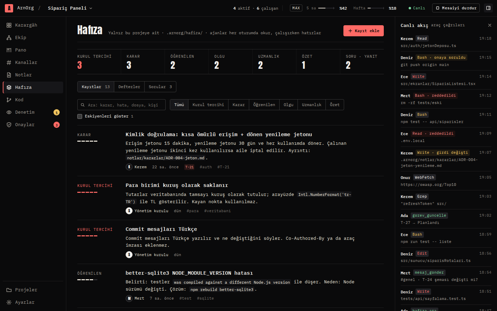
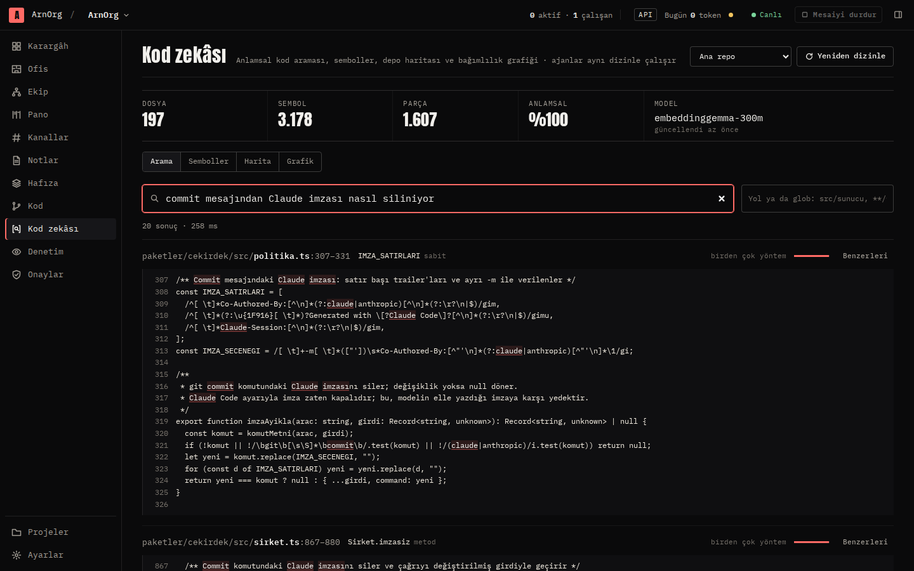
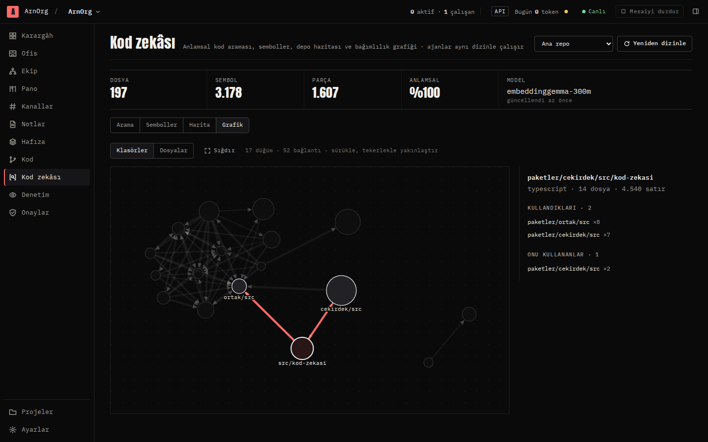
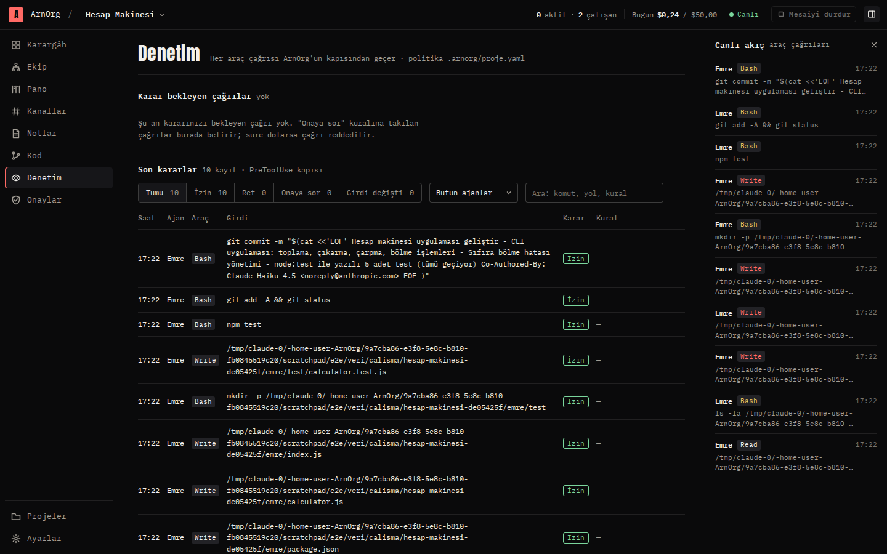
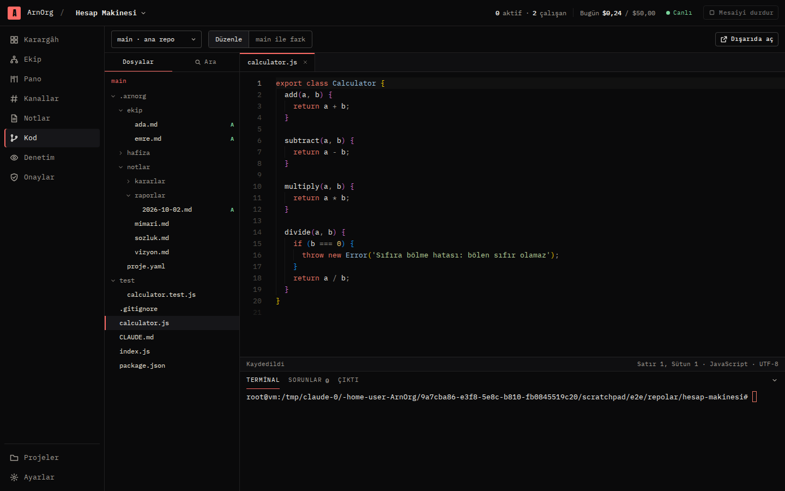

# ArnOrg

Claude Code ajanlarından kurulan bir yazılım şirketi. Projeyi siz açarsınız; CEO ajanı planı yazar, ekibi işe alır, işi dağıtır ve size rapor verir. Her ajanın her araç çağrısı ArnOrg'un denetiminden geçer.

- Windows ve Linux'ta çalışan masaüstü uygulaması + sunucu modu
- Claude aboneliğiyle çalışır (Pro/Max): ücret alınmaz, üst çubukta 5 saatlik ve haftalık pencere yüzdesi; ajanlar kurulun belirlediği yüzdede durur, pencere açılınca kaldıkları yerden sürer. İsterseniz API anahtarı ve dolar bütçesiyle de çalışır
- Proje başına notlar, kararlar ve ekip kimlikleri; repo içinde `.arnorg/` altında sürümlü
- Proje bazlı kalıcı hafıza: kurul tercihleri, kararlar, öğrenilen hatalar, kim neyi biliyor. Ajan her oturumda okur; çalışırken doğru anda hatırlar (ekipten yeni kayıt, aynı hata, dokunduğu dosya). Her ajanın kendi defteri vardır; bilmediğini ekip arkadaşına sorar, kime soracağını bilmezse ArnOrg uzmanı bulur, aynı soru ikinci kez sorulursa önceki yanıt döner. Toplantıda görüşler paralel toplanır, karar hafızaya yazılır; devralınan görev önceki sahibin defteriyle gelir
- Her ajan kendi git çalışma alanında; main'e yalnız kurulun onayladığı iş girer
- Kanallar, `@anma` ile uyandırma, görev panosu, bütçe ve onay kapıları
- Ofis: şirketin canlı 2D hâli. Ajanlar masalarında çalışır, birbirine yürüyüp konuşur, toplantı odasına gelir, kararınızı kurul masasında bekler; yeni gelen kapıdan girer, onaylanan iş sunucu odasında main'e birleşir. Hepsi çekirdeğin gerçek olaylarıyla
- Canlı denetim: politika (yıkıcı komut, gizli dosya, alan dışı yazma, dışarı push), araya girme, kesme
- Yerleşik VS Code tezgâhı (Türkçe): ana repo ve her ajan worktree'si ayrı kök; terminal, arama, kaynak denetimi, ajan rozetleri, "Duraklat ve düzenle"
- Kod zekâsı: kod tarayıcı, sembol ve bağımlılık haritası, anlamsal (vektörel) kod dizini. Türkçe ya da İngilizce doğal dille ("ajanlar arası soru nasıl yönlendiriliyor") kod aranır; anlamsal arama, anahtar sözcük ve sembol adı birleşir. Model (EmbeddingGemma ya da e5-small) makinede çalışır, kod dışarı gitmez. Ajanlar `kod_ara`, `sembol_bul`, `kod_haritasi`, `bagimliliklar`, `benzer_kod` araçlarıyla aynı dizini kullanır; görev verilirken ilgili kod konumları mesaja eklenir. Dizin artımlıdır ve ajan worktree'leri arasında paylaşılır
- Tıkanma koruması: ilerlemeyen görev önce sorumluya hatırlatılır, sonra yöneticiye ve kurula iletilir
- Dönem raporu: biten, süren, tıkanan işler, harcama ve denetim özeti notlara yazılır
- Ajan commit'leri makinedeki git kimliğinizle atılır; Claude imzası (Co-Authored-By) eklenmez, elle yazılırsa denetim kapısı siler



## Durum

Faz 0–2 tamam, Faz 3'ün bir kısmı çalışıyor. Uçtan uca doğrulandı: Stüdyo'dan proje açılır, brief verilir, CEO işe alım teklif eder, onaylanınca görev açılıp çalışan başlar, çalışan kendi worktree'sinde kodu yazıp test eder, CEO farkı inceleyip birleştirme ister, kurul onaylayınca iş main'e girer. Gerçek bir Claude Code oturumuyla (haiku) bu döngü yaklaşık iki dakika ve $0,25 tuttu.

| Ekran | |
|---|---|
| Ofis |  |
| Ekip ve ajan paneli |  |
| Kanallar |  |
| Hafıza |  |
| Kod zekâsı |  |
| Bağımlılık grafiği |  |
| Denetim |  |
| Kod (VS Code tezgâhı) |  |

## Çalıştırma

Gerekenler: Node.js 22+, git, makinede Claude Code girişi. Abonelikle çalışmak için terminalde bir kez `claude` açıp `/login` ile claude.ai hesabınızla giriş yapın; ArnOrg ajanları bu girişi kullanır, ortamda API anahtarı olsa bile ajanlara vermez. Windows'ta Git for Windows önerilir.

```bash
npm install
npm run build          # Stüdyo + çekirdek
npm run serve          # http://127.0.0.1:47820 — terminale erişim anahtarlı bağlantı yazılır
```

Masaüstü uygulaması:

```bash
npm run build && npm run masaustu    # Electron içinde çekirdek + Stüdyo
npm run paketle                      # bulunduğunuz platformun paketleri (Linux: AppImage, deb, rpm; Windows: NSIS, MSI)
```

Sürüm paketleri `v*` etiketinde GitHub Actions'ta Windows ve Linux için üretilir; ayrıntı [`paketler/masaustu/README.md`](paketler/masaustu/README.md).

Geliştirme:

```bash
npm run dev            # çekirdek, değişiklikte yeniden başlar
npm run dev:studyo     # arayüz (Vite), /api ve /ws çekirdeğe yönlenir
npm run sahte -w @arnorg/studyo   # Claude'suz sahte çekirdek, arayüz geliştirmek için
npm test               # birim ve entegrasyon testleri (Claude çağırmaz)
```

Sunucu modu: `node paketler/cekirdek/dist/cli.js serve --host 0.0.0.0 --izinli-host arnorg.ornek.com --veri /var/lib/arnorg`. Dışarıya açarken önüne Cloudflare Access gibi bir kimlik katmanı koyun.

Deneme için tüm ajanları ucuz modelle çalıştırmak: `ARNORG_MODEL_ZORLA=haiku npm run serve`.

## Belgeler

- Plan: [`docs/ONIZLEME.md`](docs/ONIZLEME.md)
- API sözleşmesi: [`docs/API.md`](docs/API.md)
- Claude Code protokolleri ve denetim: [`docs/PROTOKOLLER.md`](docs/PROTOKOLLER.md)
- Gözcü denemesi: [`deneyler/gozcu`](deneyler/gozcu)
- Tıklanabilir maket: [`docs/onizleme.html`](docs/onizleme.html)

## Yapı

```
paketler/
  ortak/      Çekirdek ile Stüdyo arasındaki tipler
  cekirdek/   arnorg-server: ajan oturumları (Agent SDK), denetim kapısı, şirket, API
  studyo/     React arayüzü
  masaustu/   Electron kabuğu ve paketleme
```
