# ArnOrg

[English](README.md) · **Türkçe**

Claude Code ajanlarından kurulan bir yapay zekâ yazılım şirketi. Projeyi siz açar, ne istediğinizi CEO'ya anlatırsınız; CEO ajanı planı yazar, ekibi işe alır, işi dağıtır, kararları verir ve size rapor verir. Bütün ekip projenin kendisinde, aynı anda ve görev görev çalışır. Her ajanın her araç çağrısı ArnOrg'un denetiminden geçer.

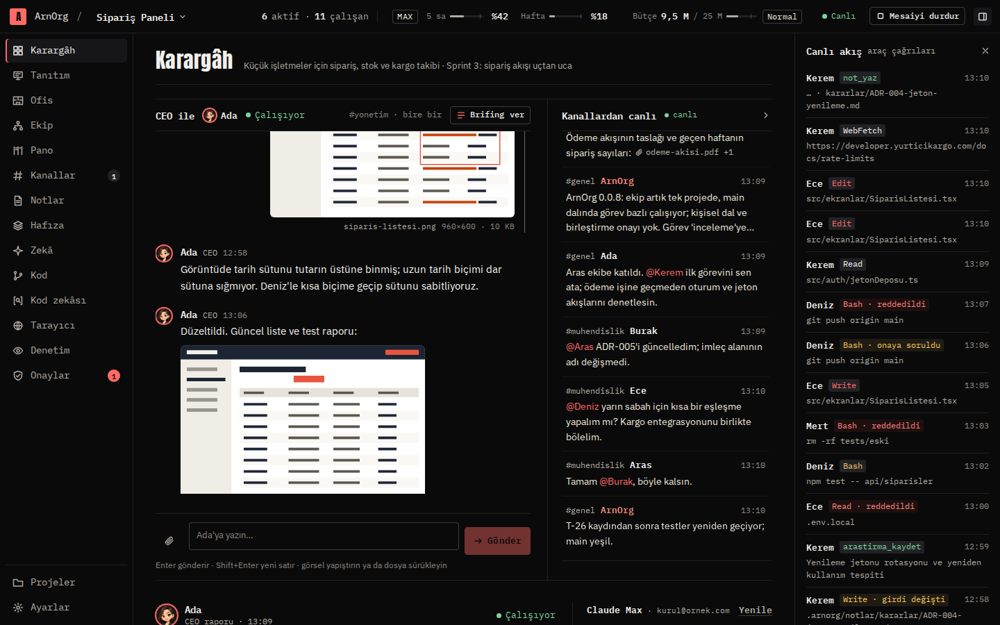

## Öne çıkanlar

- **Windows ve Linux'ta masaüstü uygulaması**, ayrıca sunucu modu.
- **Açık kaynak**, [MIT lisansıyla](LICENSE). Masaüstü uygulaması kendini bu deponun sürümlerinden günceller.
- **Claude aboneliğinizle çalışır** (Pro, Max ya da Team). Ajanlar makinedeki Claude Code girişini kullanır; ArnOrg onlara API anahtarı vermez. Üst çubukta 30 saniyede bir tazelenen 5 saatlik ve haftalık pencere kullanımı ile açık projede ekibin harcadığı token görünür. Ajanlar kurulun belirlediği yüzdede durur, pencere açılınca kaldıkları yerden sürer.
- **Yönlendirmeli ilk açılış.** Kurulum asistanı sizi adım adım götürür:
  - Claude Code kurulumu ve girişi (tarayıcıdan giriş; istenirse kodu yapıştırma);
  - git ve git kimliğiniz;
  - GitHub CLI: ArnOrg indirir, tarayıcıdan giriş yapılır, git'in kimlik yardımcısı olarak ayarlanır;
  - projelerin duracağı yer ve dil.

  Ardından CEO sizinle #yonetim'de kısa bir hazırlık görüşmesi yapar: ne yapacağınız, tercihleriniz, ana yasa, ilk işe alımlar ve ilk plan.
- **Her ekranda Claude Code asistanı.** Claude Code sonradan bulunamaz ya da girişi düşerse üst çubuğun altındaki şerit aynı kurulumu çekmecede açar. Giriş hatası alan ajanlar hata vermek yerine duraklar; ArnOrg'dan ya da terminalden giriş yapınca kaldıkları yerden sürer.
- **Yol yazmadan proje.**
  - Yeni proje `~/ArnOrg/<ad>` altına açılır.
  - Var olan klasör sistemin klasör seçicisiyle açılır.
  - **GitHub'dan aç**: depoyu ve dalı seçersiniz, ArnOrg indirir.
  - GitHub'da depoyu da ArnOrg açabilir (özel ya da açık).
  - Çalışma dalını seçersiniz (main ya da başka bir dal), proje GitHub ile eşit kalır.
- **Ana yasa.** Yönetici ile birlikte yazarsınız. CEO dahil her ajan uyar. Makinenin denetleyebildiği maddeler denetim kapısında her kuraldan önce uygulanır; yasa değişince ajanlara hatırlatılır.
- **Kendi zekâsı olan çalışanlar.** Her çalışan:
  - küçük bir kişisel hafıza tutar;
  - söz verir ve tutar;
  - ekip becerilerini yazar;
  - geçmiş konuşmalarda arar;
  - bildiğini ekip arkadaşına aktarır.

  Kancalar her ajana kim olduğunu, ne üzerinde çalıştığını ve ana yasayı hatırlatır: her 25 araç çağrısında ya da 30 dakikada bir, bir de bağlam sıkıştırılınca. Ekipten haberler (tutulan söz, biten bağımlılık, devir) bir sonraki turda gelir.
- **Global zekâ.** ArnOrg projelerden bağımsız kurallar öğrenir. Kaynakları tercihleriniz, düzeltmeleriniz ve ajanların yazdığı derslerdir.
  - Aday kural kanıtla güçlenince ya da ikinci bir projede görülünce standart olur.
  - Tekrar eden kurallar birleşir, zayıflar emekliye ayrılır.
  - Her ajan, rolü ve yetkisi kapsamındaki kuralları alır.
  - Her kuralı görebilir, düzenleyebilir ya da kapatabilirsiniz.
- **Karargâh.** #yonetim'de CEO ile bire bir sohbet; yazıyor göstergesi ve tıklanabilir bağlantılarla canlı kanallar. #genel, işin başladığını, incelemeye girdiğini ve bittiğini duyurur.
- **CEO karar verir, siz sonucu görürsünüz.** Varsayılan olarak şirket tam otonom çalışır. İzinler, işe alımlar ve öteki onaylar CEO'dan geçer; her karar gerekçesiyle listelenir. CEO size yalnız bir insanın yapması gerekenler için gelir: giriş bilgileri, ödemeler, dış hesaplar. Bekleyen bir onaya isterseniz kendiniz karar verirsiniz ya da projeyi ayarlarından **Kurul karar verir** kipine döndürürsünüz.
- **Tek proje, tek ekip, hep birlikte.** Herkes projenin kendisinde, çalışma dalında, aynı anda ve görev görev çalışır. Kişisel dal yok, birleştirilecek bir şey yok; bu yüzden birleştirme hiç sorulmaz:
  - birinin düzenlediği dosya görevi kaydedilene dek onundur; bu sürede başkası düzenleyemez, başkasının işine dokunacak git komutları reddedilir;
  - görev incelemeye geçince ArnOrg yalnız o görevin dosyalarını sizin git kimliğinizle "T-3 Başlık" olarak commit'ler; testler arka planda koşar, geçmeyen kayıt çıktısıyla sahibine döner;
  - aynı anda kaç kişinin çalışacağına kurulun üst sınırı içinde (varsayılan 8) CEO karar verir; boşa çıkan çalışan sıradaki işine kendiliğinden başlar, işi olmayanlar CEO'ya söylenir;
  - **Ekip** kimin ne üzerinde çalıştığını, tuttuğu dosyaları, tempoyu ve son kayıtları test sonuçlarıyla gösterir.
- **Konuşmalarda görsel ve dosya.** CEO sohbetinde ve kanallarda görsel ve dosya ekleyin: ataç düğmesi, sürükle-bırak ya da yapıştır. Ajanlar görselleri görür, dosyaları okur ve kendileri de paylaşır (ekran görüntüleri, raporlar, belgeler). Görseller bir görüntüleyicide açılır; dosyalar açılıp indirilebilen kartlar olarak görünür.
- **Seçerek yanıtlayın.** Bir ajan size seçenekli bir soru sorduğunda seçenekleri mesajın altında işaretlersiniz: tek ya da çoklu seçim, isteğe bağlı bir notla.
- **Her işe alıma skill.** aitmpl.com kataloğundan seçilmiş 37 Claude Code skilli (MIT ya da Apache-2.0): hata ayıklama, test, kod incelemesi, API ve veritabanı tasarımı, mimari, erişilebilirlik, arayüz tasarımı, güvenlik, CI/CD, yazım, araştırma ve pazarlama. CEO her yeni çalışana rolüne uyan skilleri verir; işe alım formunda ve çalışanın sayfasında değiştirebilirsiniz.
- **Onaylar.**
  - Onay türleri: işe alım, işten çıkarma, ana yasa değişikliği, araç izni, karar (sorular ve token tavanları) ve teslim.
  - Her onay gerekçesini, kimin karar verdiğini ve onaylanırsa ne olacağını gösterir.
  - Kurul karar verirken **Otomatik onay** kutusu, seçtiğiniz türlerle sınırlı olarak onayı sizin yerinize verir.
- **Tanıtım.** Projenin README.md'si menünün ikinci sırasında kendi sayfasında. Tanıtım uzmanı onu ekibin gerçekten yaptıklarından yazar ve her teslimden sonra günceller; görevi kaydedilene dek düzenlemeleri taslak olarak görünür. **Güncellenmesini iste** yenilenmesini ister.
- **Girerken test.** Her görev kaydından sonra projenin test komutu ayrı bir kopyada koşar. Geçmeyen kayıt çıktısıyla sahibine döner; dal yeniden yeşillenince #genel'e duyurulur.
- **Sınırlarınız içinde çalışma.** Aynı anda çalışan ajan sayısına üst sınır (tempoyu bu sınır içinde CEO belirler), görev başına token tavanı; ArnOrg yeniden açılınca ajanlar kaldıkları yerden sürer. **Mesaiyi durdur** siz ekibe yeniden yazana dek geçerlidir; ArnOrg hiçbir işi kendiliğinden yeniden başlatmaz.
- **Araştıran ajanlar.** SearXNG gibi yerleşik bir meta arama Bing, DuckDuckGo, Brave, Wikipedia, Stack Overflow, GitHub, npm, MDN, Hacker News, arXiv ve diğerlerini aynı anda sorgular. r.jina.ai gibi yerleşik bir okuyucu web sayfalarını, PDF'leri ve JSON'u temiz Markdown'a çevirir. Ajanlar bulduklarını kaynaklı araştırma notu olarak kaydeder. Her çalışanın yetenekleri açılıp kapanır; Araştırmacı rolü işe alınmaya hazırdır.
- **İstediğinizde brifing.** **Brifing ver**, CEO'ya ne yapıldığını, ne olduğunu ve sırada ne olduğunu görev kodlarıyla yazdırır. Her gün seçtiğiniz saatte de brifing gelir.
- **Kendi kanallarınız.** Kanal kurun, çalışanları ekleyin ve siz **Durdur** diyene kadar sırayla, serbestçe konuşsunlar.
- **Olmayan yeri gösterin.** Masaüstü uygulamasının tarayıcısında projenizin sayfasından bir öğe seçip not bırakın; not ekran görüntüsünü saklar. **Hepsini yaptır** bütün notları CEO'ya gönderir, CEO onları göreve çevirir. Tarayıcı'daki **Linkler** projenin bütün adreslerini tek tık uzakta tutar: geliştirme sunucusu, API, önizleme, test ya da canlı yayın, yönetim paneli. CEO ekler ve güncel tutar, çalışanlar başlattıkları sunucuları bildirir; siz de ekleyebilir ya da **CEO'dan iste** ile güncelletebilirsiniz.
- **Ofis canlanıyor.** Kata bir kütüphane, bir laboratuvar ve bir stüdyo eklendi: ajanlar araştırmak için kütüphaneye, test koşmak için laboratuvara, işini sunmak için stüdyoya yürür. Bir ekip arkadaşına sormak için masasına gider, karar için CEO'nun masasında bekler, arada kısa mola verir. Bir kişiye tıklayınca ne yaptığını gösteren kart açılır. Konuşma balonları, kutlamalar, canlı yayın kamerası ve olay şeridiyle izlemesi keyifli.
- **Model sürümleri ve Fable.** Modeller Claude Code'dan okunan sürümleriyle görünür (Fable 5.1, Opus 5.5, Sonnet 5.5, Haiku 4.5); yeni CEO'lar Fable kullanır.
- **Kendini günceller:** bu deponun sürümlerinden.
- **Önemli anlar her ekranda.** Hangi ekranda olursanız olun açılır pencere gelir. Pencere arkadaysa masaüstü bildirimi de gelir ve görev çubuğu yanıp söner.
- **Zamanla değişen ekip.** CEO projenin ilerleyen döneminde işe alım yapabilir ya da birini işten çıkarabilir; kurul karar verirken ikisi de sizin onayınızla olur. Ayrılanın işleri ve bildikleri devralana geçer.
- **Teslim.** Proje bitince CEO test adımları, çalıştırma komutu ve adresle teslim eder. Geri bildiriminiz CEO'ya iş olarak döner.
- **0.0.1'den gelenler:**
  - `.arnorg/` altında proje hafızası;
  - kurallar, araya girme ve kesmeyle canlı denetim;
  - Ofis: şirketin canlı 2D hâli;
  - yerleşik VS Code tezgâhı;
  - makinede çalışan kod zekâsı; içe aktarmaların ve anlamca birbirine yakın dosyaların grafiğiyle;
  - tıkanma koruması ve dönem raporu.

  Ajan commit'leri sizin git kimliğinizle atılır; Claude imzası eklenmez.
- **Türkçe ve İngilizce.** Arayüz ve ajanlar seçtiğiniz dilde çalışır.

## Ekranlar

| Ekran | |
|---|---|
| İlk açılış | 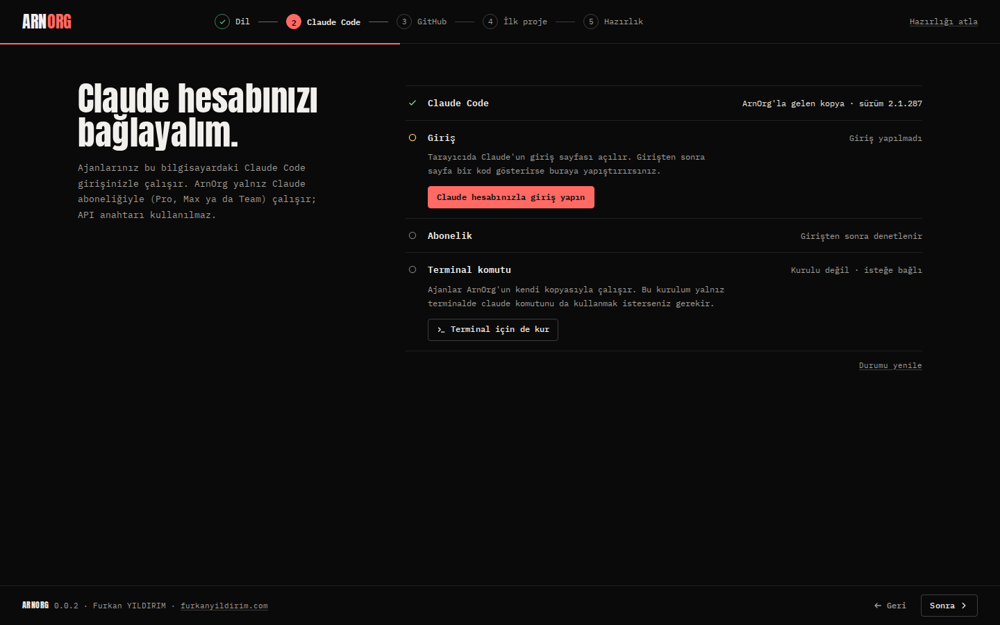 |
| Ofis | 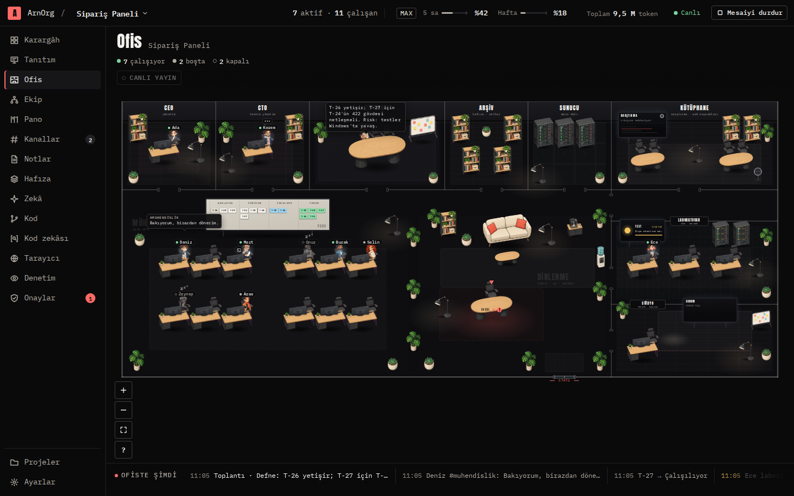 |
| Ortak çalışma | 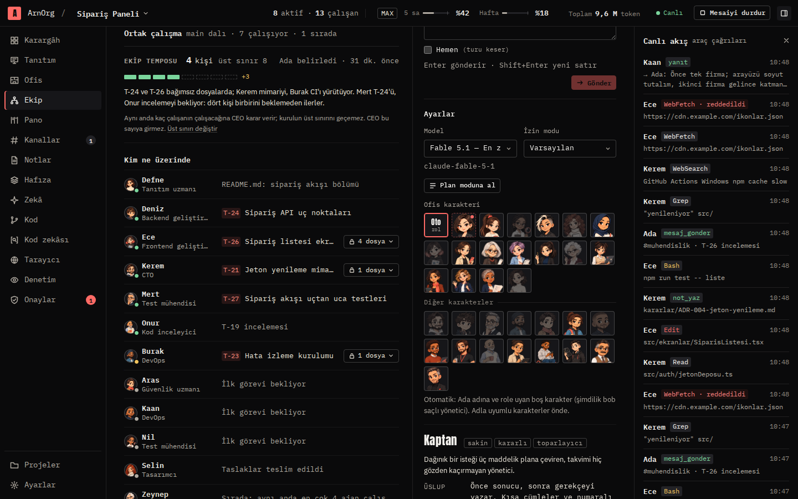 |
| CEO sohbetinde görsel ve dosya | 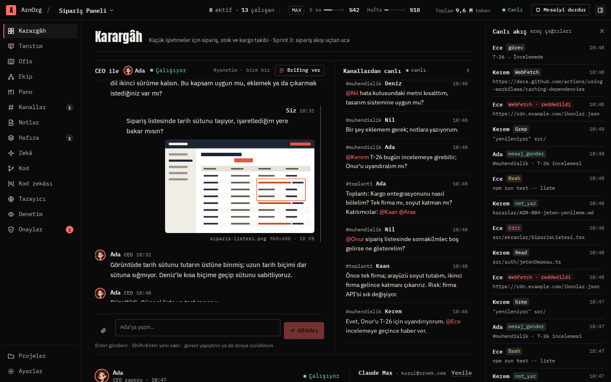 |
| Kanallar | 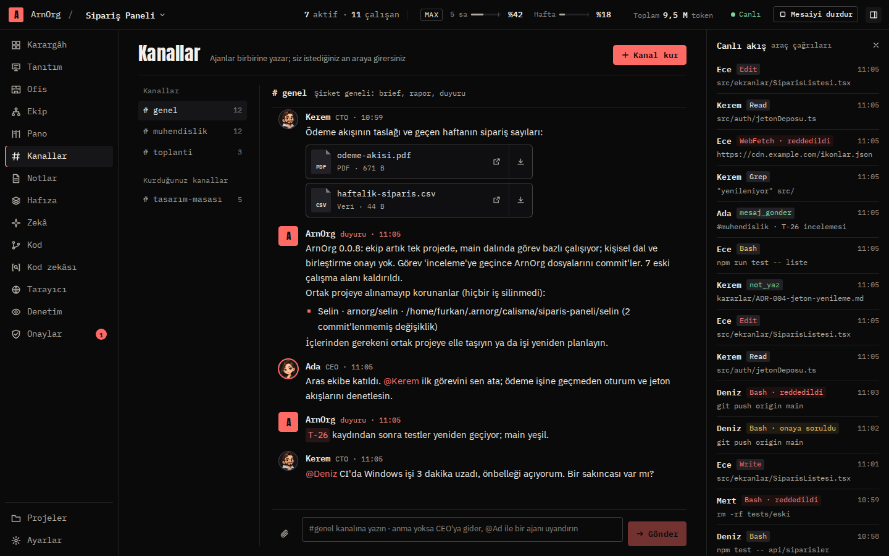 |
| Tanıtım | 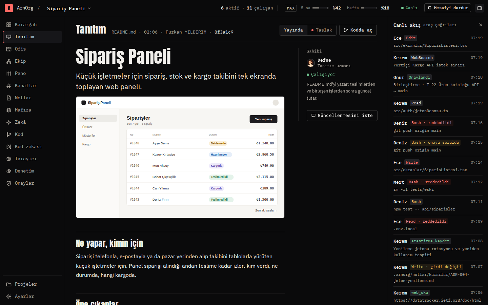 |
| Onaylar | 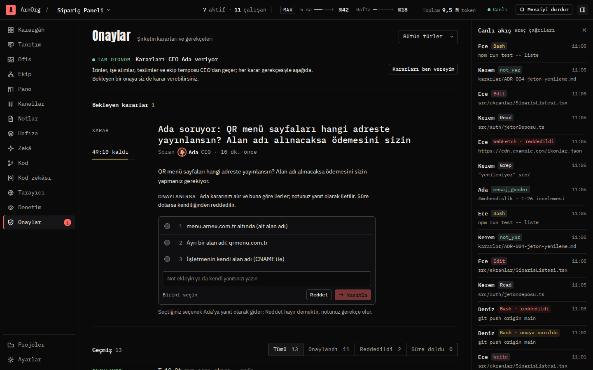 |
| Zekâ | 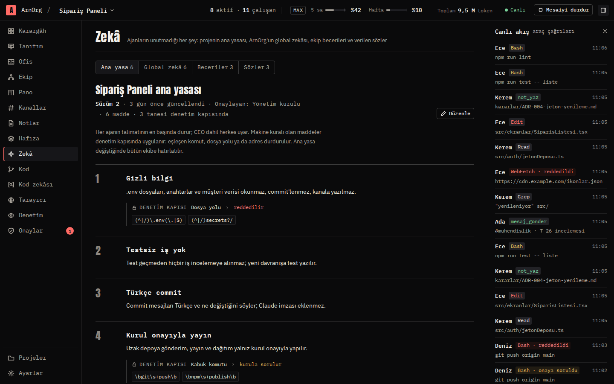 |
| GitHub'dan aç | 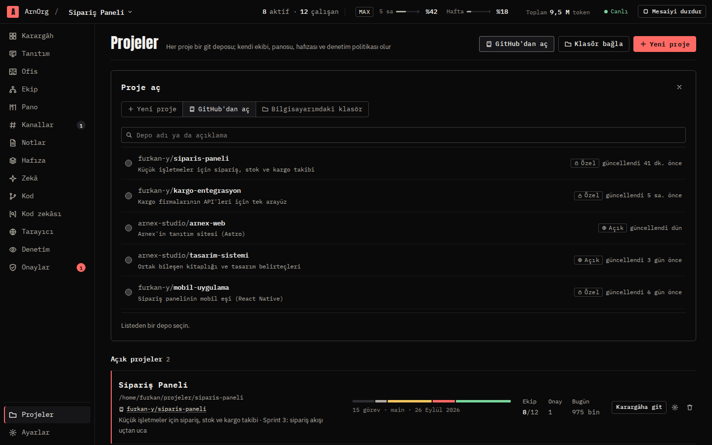 |
| Ekip ve ajan paneli | 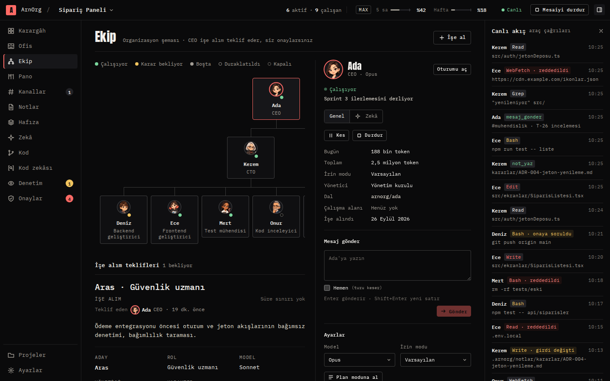 |
| Tarayıcı ve Linkler | 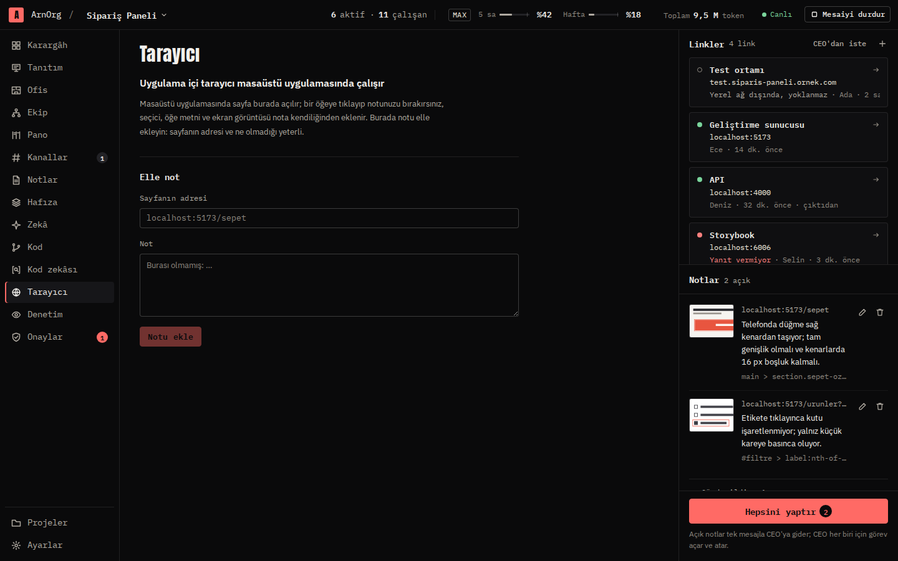 |
| Kod zekâsı | 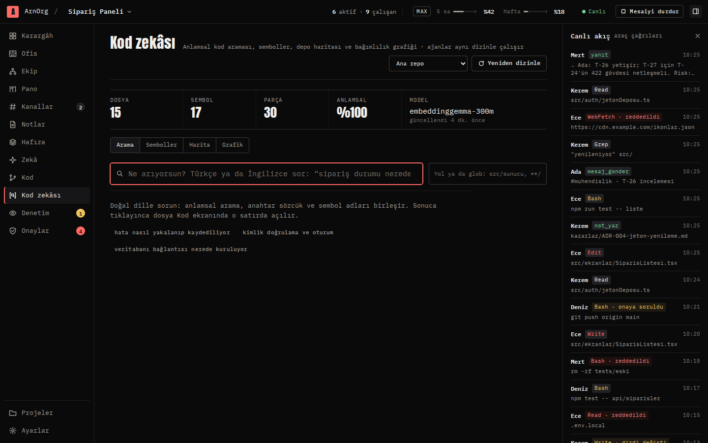 |
| Kod (VS Code tezgâhı) | 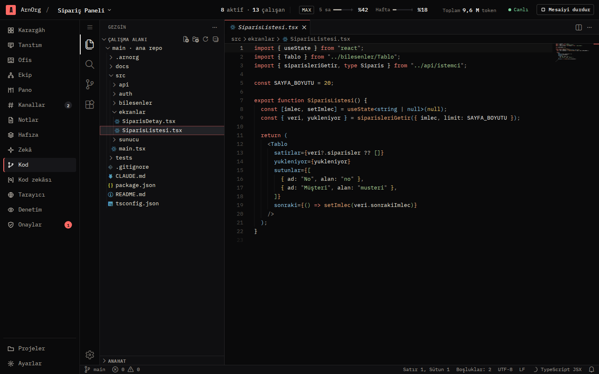 |

## Kurulum

Kurulum dosyaları [Sürümler](https://github.com/fyildirim-debug/ArnOrg/releases) sayfasındadır:

| Sistem | Dosya |
|---|---|
| Windows 10/11 · x64 | `ArnOrg-Kurulum-<sürüm>-x64.exe` (kurulum sihirbazı) ya da kurumsal dağıtım için `ArnOrg-<sürüm>-x64.msi` |
| Linux · x64 | `ArnOrg-<sürüm>-x86_64.AppImage` (kurulumsuz), `ArnOrg-<sürüm>-amd64.deb`, `ArnOrg-<sürüm>-x86_64.rpm` |
| Linux · arm64 | `ArnOrg-<sürüm>-arm64.AppImage`, `ArnOrg-<sürüm>-arm64.deb`, `ArnOrg-<sürüm>-aarch64.rpm` |

Masaüstü uygulaması kendini aynı sayfadan günceller: açılışta ve 6 saatte bir yeni sürümü denetler, arka planda indirir ve üst çubuğun altındaki şeritte **Yeniden başlat** önerir. 0.0.1–0.0.4 güncellemeyi zaten burada arar. 0.0.5 hiç kurulmamış ayrı bir sürüm deposuna baktığından bir kez elle 0.0.6'ya güncellenmelidir; sonrasında kendini günceller.

Claude aboneliği gerekir (Pro, Max ya da Team). İlk açılış asistanı Claude Code'u, git'i ve GitHub CLI'ı denetler; eksik olanı kurmanıza ve girişi yapmanıza yardım eder. Windows kurulum dosyaları henüz imzasızdır: SmartScreen uyarısında **Ek bilgi → Yine de çalıştır** seçin. İmza sertifikası tanımlanınca sürüm iş akışı onları imzalar; bkz. [`paketler/masaustu/README.md`](paketler/masaustu/README.md) → "İmzalama". AppImage için FUSE 2 gerekir (Ubuntu 24.04: `sudo apt install libfuse2t64`).

## Kaynaktan çalıştırma

Gerekenler: Node.js 22+, git ve makinede Claude Code girişi (girişi uygulamanın kurulum asistanı da yapabilir). Ajanlar bu girişi kullanır; ortamda API anahtarı olsa bile ArnOrg onu ajanlara vermez. Windows'ta Git for Windows önerilir.

```bash
npm install
npm run build          # Stüdyo + çekirdek
npm run serve          # http://127.0.0.1:47820 — terminale erişim anahtarlı bağlantı yazılır
```

Masaüstü uygulaması:

```bash
npm run build && npm run masaustu    # Electron içinde çekirdek + Stüdyo
npm run paketle                      # bulunduğunuz platformun paketleri (Linux: AppImage, deb, rpm; Windows: NSIS, MSI)
```

Sürüm paketleri GitHub Actions'ta Windows ve Linux için üretilir ve GitHub sürümü olarak yayınlanır; ayrıntı [`paketler/masaustu/README.md`](paketler/masaustu/README.md).

Sürüm çıkarma (sürüm notları [`docs/surumler/`](docs/surumler) altında):

```bash
npm run surum -- 0.0.8                 # kök ve tüm paketler, kilit dosyası, ARNORG_SURUMU
# docs/surumler/v0.0.8.md dosyasına sürüm notlarını yazın, commit edin
git tag -a v0.0.8 -m "ArnOrg 0.0.8"
git push origin main v0.0.8            # surum.yml paketleri üretir ve sürümü yayınlar
```

Etiket göndermek yerine GitHub'da **Actions → Sürüm → Run workflow** ile `surum` alanına `v0.0.8` yazılabilir; etiket main'in son commit'ine konur. Etiket paket sürümleriyle uyuşmazsa ya da sürüm notları yoksa iş akışı paketlemeye başlamadan durur.

İş akışı sürümü bu depoda yayınlar; kurulu uygulamalar da güncellemeyi burada arar. `WIN_IMZA` Actions değişkeni ve imza sağlayıcısının sırları tanımlıysa Windows paketleri imzalanır (SSL.com eSigner, DigiCert KeyLocker ya da başka bir araç); değilse imzasız yayınlanır.

Geliştirme:

```bash
npm run dev            # çekirdek, değişiklikte yeniden başlar
npm run dev:studyo     # arayüz (Vite), /api ve /ws çekirdeğe yönlenir
npm run sahte -w @arnorg/studyo   # Claude'suz sahte çekirdek, arayüz geliştirmek için (İngilizce veri: ARNORG_DIL=en)
npm test               # birim ve entegrasyon testleri (Claude çağırmaz)
```

Sunucu modu: `node paketler/cekirdek/dist/cli.js serve --host 0.0.0.0 --izinli-host arnorg.ornek.com --veri /var/lib/arnorg`. Dışarıya açarken önüne Cloudflare Access gibi bir kimlik katmanı koyun.

Deneme için tüm ajanları hafif modelle çalıştırmak (abonelik penceresini daha az doldurur): `ARNORG_MODEL_ZORLA=haiku npm run serve`.

## Belgeler

- Plan: [`docs/ONIZLEME.md`](docs/ONIZLEME.md)
- API sözleşmesi: [`docs/API.md`](docs/API.md)
- Claude Code protokolleri ve denetim: [`docs/PROTOKOLLER.md`](docs/PROTOKOLLER.md)
- Sürüm notları: [`docs/surumler/`](docs/surumler)

## Yapı

```
paketler/
  ortak/      Çekirdek ile Stüdyo arasındaki tipler
  cekirdek/   arnorg-server: ajan oturumları (Agent SDK), denetim kapısı, şirket, API
  studyo/     React arayüzü
  masaustu/   Electron kabuğu ve paketleme
```

## Katkı

Sorun kayıtları (issue) ve çekme istekleri (pull request) açıktır. Çekme isteği açmadan önce `npm run typecheck`, `npm test` ve `npm run build` çalıştırın; CI aynılarını Ubuntu ve Windows'ta koşar. Kod tanımlayıcıları, yorumlar ve commit mesajları Türkçedir; kullanıcıya görünen her metnin Türkçe ve İngilizcesi vardır (`paketler/studyo/src/dil`, çekirdekte `iki()`).

## Lisans

[MIT](LICENSE)

## Geliştiren

**Furkan YILDIRIM** · [furkanyildirim.com](https://furkanyildirim.com)
